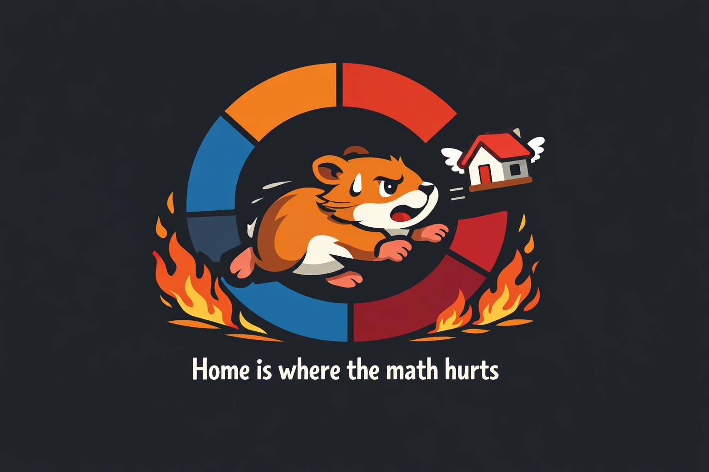

<p align="center">
  
</p>

<h1 align="center">Kabala</h1>

<p align="center">
  <strong>Global Cost of Living Explorer</strong><br>
  Compare purchasing power, housing affordability, and living expenses across 86+ cities worldwide
</p>

<p align="center">
  <a href="#features">Features</a> •
  <a href="#demo">Demo</a> •
  <a href="#getting-started">Getting Started</a> •
  <a href="#data-sources">Data Sources</a> •
  <a href="#tech-stack">Tech Stack</a>
</p>

<p align="center">
  <a href="https://kabala-production.up.railway.app/"><strong>🚀 Live Demo</strong></a>
</p>

---

## Features

### Interactive World Map
Explore cities on an interactive map with hover previews showing key metrics at a glance.

### City Comparison
Compare multiple cities side-by-side across all metrics — rent, groceries, restaurants, transportation, and salaries.

### Time to Home Calculator
Calculate how long it will take to save for a home based on your income, expenses, and target city. Includes:
- Single & couple income modes
- Mortgage vs. rent analysis
- "What if" scenarios
- Life timeline visualization

### Rankings & Filters
Sort and filter cities by any metric to find the best match for your lifestyle and budget.

### Budget Calculator
Plan your monthly expenses and see how far your money goes in different cities.

### Historical Trends
Track how costs have changed over time with inflation-adjusted charts.

### Multi-Currency Support
View prices in USD or local currency for accurate comparisons.

---

## Demo

| Feature | Description |
|---------|-------------|
| 🗺️ **Map View** | Interactive map with city markers colored by region (CIS, EU, Other) |
| 📊 **Cost Table** | Sortable table with rent, food, and salary data |
| 🏠 **Time to Home** | Personalized home affordability calculator |
| 📈 **Trends** | Historical price and inflation charts |

---

## Getting Started

### Prerequisites

- Node.js 20.9.0 or higher
- npm, yarn, pnpm, or bun

### Installation

```bash
# Clone the repository
git clone https://github.com/your-username/kabala.git
cd kabala

# Install dependencies
npm install

# Start the development server
npm run dev
```

Open [http://localhost:3000](http://localhost:3000) to explore.

### Build for Production

```bash
npm run build
npm start
```

---

## Data Sources

- **Cost of Living Data**: [Numbeo](https://www.numbeo.com/) — crowdsourced price database
- **Inflation Rates**: [IMF World Economic Outlook](https://www.imf.org/en/Publications/WEO)
- **Property Prices**: Aggregated from local real estate platforms

Data is updated periodically using automated scrapers with retry logic and rate limiting.

---

## Tech Stack

- **Framework**: [Next.js 16](https://nextjs.org/) with App Router
- **Language**: TypeScript
- **Styling**: Tailwind CSS 4
- **Charts**: Recharts
- **Maps**: React Simple Maps + D3 Geo
- **Runtime**: React 19

---

## Project Structure

```
src/
├── app/                    # Next.js pages
│   ├── page.tsx           # Home (map + table)
│   ├── city/[slug]/       # City detail pages
│   ├── compare/           # City comparison
│   ├── rankings/          # Sortable rankings
│   ├── calculator/        # Budget calculator
│   └── time-to-home/      # Affordability calculator
├── components/            # React components
│   ├── Map/              # World map & markers
│   ├── City/             # City detail components
│   ├── Charts/           # Recharts visualizations
│   ├── Compare/          # Comparison tools
│   ├── Calculator/       # Budget forms
│   ├── Rankings/         # Table & filters
│   └── TimeToHome/       # Affordability calculator
├── data/                  # JSON data files
│   ├── cities.json       # City metrics
│   └── inflation.json    # Historical inflation
├── lib/                   # Utilities
│   ├── data.ts           # Data loading
│   ├── currency.ts       # Currency conversion
│   ├── tax.ts            # Tax calculations
│   └── i18n.ts           # Internationalization
└── types/                 # TypeScript definitions
```

---

## License

MIT

---

<p align="center">
  <em>"Home is where the math hurts"</em> 🐹🔥
</p>
